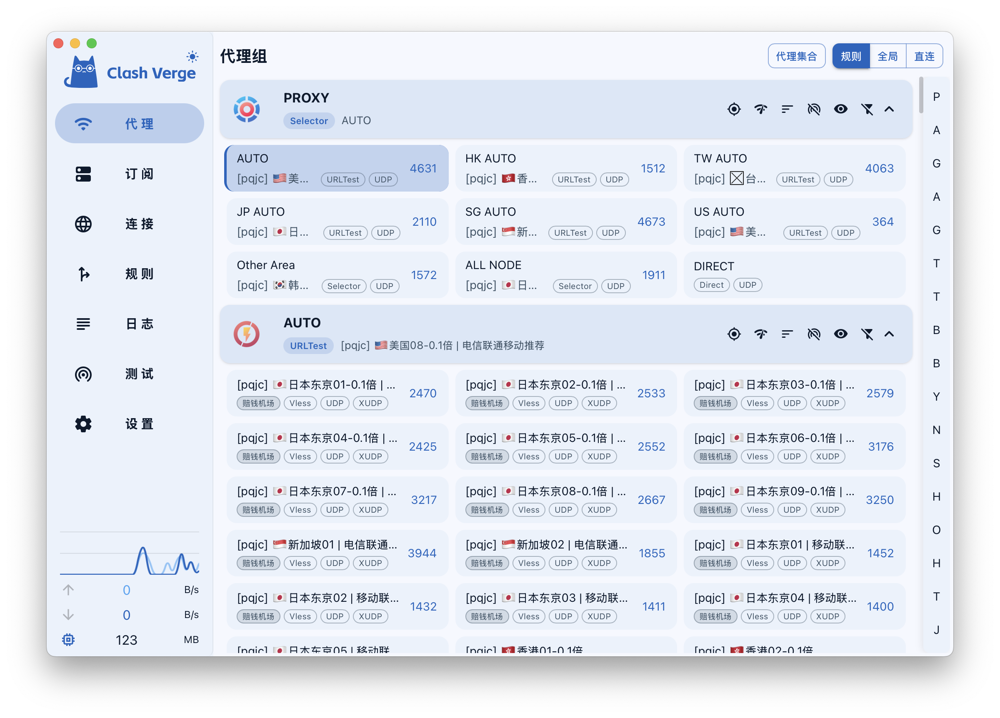

<h1 align="center">
  
  <br>
  Clash Verge Self
  <br>
</h1>

<h3 align="center">
基于 <a href="https://github.com/tauri-apps/tauri">Tauri</a> 构建的 <a href="https://github.com/MetaCubeX/mihomo">Mihomo</a> 图形化客户端。
</h3>

<p align="center">
  <a href="https://github.com/oomeow/clash-verge-self/releases"></a>
  <a href="https://github.com/oomeow/clash-verge-self/blob/main/LICENSE"></a>
</p>

> [!NOTE]
>
> 本仓库 Fork 自 1.6.0 版本的 _**Clash Verge Rev**_，并基于个人需求持续进行功能定制、架构调整与性能优化。
>
> 其他 Clash 系列桌面端软件：
>
> - [Sparkle](https://github.com/xishang0128/sparkle)
> - [Clash Verge Rev](https://github.com/clash-verge-rev/clash-verge-rev)
> - [Clash Nyanpasu](https://github.com/libnyanpasu/clash-nyanpasu)
> - [FlClash](https://github.com/chen08209/FlClash)

## 预览



## 功能特性

- **Mihomo 核心** — 仅支持 [Mihomo](https://github.com/MetaCubeX/mihomo)（Clash Meta）核心。
- **配置管理** — 支持 YAML 配置管理以及 JavaScript 增强。
- **界面定制** — 支持自定义主题颜色，并持续优化用户界面与交互体验。
- **系统代理** — 支持系统代理配置及代理状态守护。
- **跨平台** — 支持 Windows、macOS 和 Linux。

## 为什么选择 Tauri？

Clash Verge Self 选择 [Tauri](https://github.com/tauri-apps/tauri)，主要看重其 **轻量、高性能以及前后端解耦** 的架构。

### 🪶 轻量高效

Tauri 使用系统原生 WebView，无需随应用捆绑完整的 Chromium 和 Node.js 运行环境，在保持 Web 技术开发效率的同时降低应用体积和运行时开销。

### 🧠 后台独立运行

Rust 后端可以**脱离 WebView 独立运行**。后台服务无需加载前端页面和浏览器渲染环境，只有在需要交互时才启动 UI。

这使应用特别适合代理客户端等需要长期驻留后台的场景，有效减少不必要的内存和 CPU 占用。

> **后台服务无需 UI，UI 按需加载。**

### 🔌 前后端解耦

```text
┌──────────────────────┐
│      Web UI          │
│  React / TypeScript  │
└──────────┬───────────┘
           │ IPC
┌──────────▼───────────┐
│     Rust Backend     │
│ 核心逻辑 / 网络 / 系统 │
└──────────────────────┘
```

UI 负责交互与展示，Rust 负责核心逻辑和后台服务，两者拥有独立的生命周期，可以在不启动 UI 的情况下保持服务运行。

### 🌍 跨平台

基于统一的 Tauri 架构支持 **Windows、macOS 和 Linux**，同时可以结合各平台原生能力实现系统托盘、系统代理、TUN、IPC 等功能。

> **现代化 UI，轻量级后台；UI 按需加载，服务独立运行。**

## FAQ

请参考 [FAQ 页面](https://clash-verge-rev.github.io/faq/windows.html)。

## 开发

开发环境配置及贡献指南请参考 [CONTRIBUTING.md](./CONTRIBUTING.md)。

```shell
pnpm i                  # 安装依赖，同时安装 prek git hooks
pnpm check              # 下载资源；本地执行时同时构建 service 二进制
                        #   --force      强制重新下载
                        #   --alpha      下载 alpha 通道的 service
                        #   --target     指定目标平台，例如 x86_64-unknown-linux-gnu
                        #   --no-confirm 跳过确认提示
pnpm build:service      # 修改 service 代码后重新构建 service 二进制
pnpm dev                # 启动开发服务器
```

## Changelog

请参考 [CHANGELOG.md](./CHANGELOG.md) 和 [UPDATELOG.md](./UPDATELOG.md)。

## Acknowledgement

Clash Verge Self was based on or inspired by these projects:

- https://github.com/clash-verge-rev/clash-verge-rev: Continuation of Clash Verge - A Clash Meta GUI based on Tauri (Windows, MacOS, Linux).
- https://github.com/zzzgydi/clash-verge: A Clash GUI based on tauri. Supports Windows, macOS and Linux.
- https://github.com/tauri-apps/tauri: Build smaller, faster, and more secure desktop applications with a web frontend.
- https://github.com/Dreamacro/clash: A rule-based tunnel in Go.
- https://github.com/MetaCubeX/mihomo: A rule-based tunnel in Go.
- https://github.com/Fndroid/clash_for_windows_pkg: A Windows/macOS GUI based on Clash.
- https://github.com/vitejs/vite: Next generation frontend tooling. It's fast!

## Activity


## License

[GPL-3.0 License](./LICENSE)
